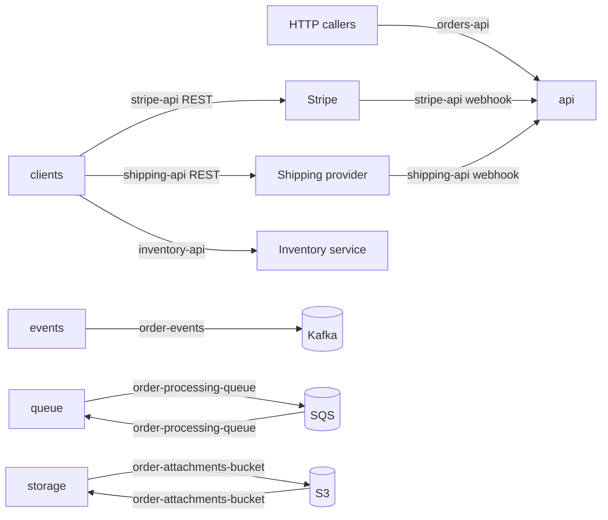

# panopticon-test-child-b — architecture overview

## Purpose

This repository is a TypeScript fixture representing order-management capabilities. It contains
an HTTP contract and stub route handlers, outbound inventory/payment/shipping clients, a Kafka
event producer, an SQS processing worker, and S3 attachment helpers.

The components are present as independent modules rather than an assembled application. There is
no `src/index.ts`, and the API routes do not call the clients, event producer, queue, or storage
helpers.

## Components

- [api](components/api.md) — defines the Orders REST contract and stub webhook receivers.
- [clients](components/clients.md) — wraps outbound inventory, Stripe, and shipping APIs.
- [events](components/events.md) — publishes order lifecycle events to Kafka.
- [queue](components/queue.md) — sends, receives, processes, and deletes SQS order jobs.
- [storage](components/storage.md) — uploads, signs, and deletes S3 order attachments.

## Architecture diagram

[org diagram](../architecture.md#panopticon-test-child-b)

## Data flow

1. The `api` routes accept `orders-api` requests and return in-memory stub responses. Separate
   `stripe-api` and `shipping-api` webhook routes acknowledge callbacks without processing them.
2. The `clients` functions consume `inventory-api`, `stripe-api`, and `shipping-api` when called,
   but no current component invokes them.
3. The `events` publisher sends caller-provided lifecycle events to `order-events`; it is not
   wired to the API or worker.
4. The `queue` helper publishes jobs to and receives jobs from `order-processing-queue`. Its
   worker logs each supported action and deletes successfully handled messages.
5. The `storage` helpers write to and read or delete from `order-attachments-bucket`; no current
   route invokes them.

## Dependencies

- Express supplies the route abstractions for `orders-api` and the webhook receivers. The repo
  does not include the application entry point needed to mount those routers.
- The inventory service, Stripe, and the shipping provider back the three outbound interfaces
  used by `clients`. Calls fail or throw when those services reject a request or cannot be reached.
- Kafka backs `order-events`; publishing fails if a producer cannot connect or send.
- AWS SQS backs `order-processing-queue`; queue failures prevent enqueue, receive, or deletion and
  can leave messages available for retry.
- AWS S3 backs `order-attachments-bucket`; S3 failures prevent attachment upload, URL signing, or
  deletion. See [interfaces.md](interfaces.md) for the indexed interface evidence.
