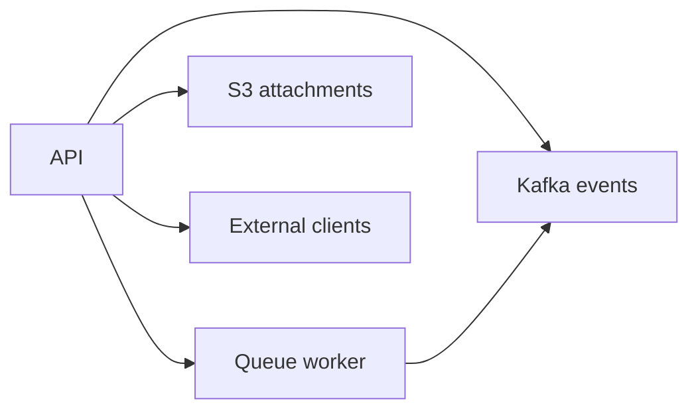

# ts-order-service architecture

This repository contains an order management API, event producer, queue worker, external service clients, and attachment storage integration.

## Architecture diagram

[org diagram](../architecture.md#ts-order-service)
