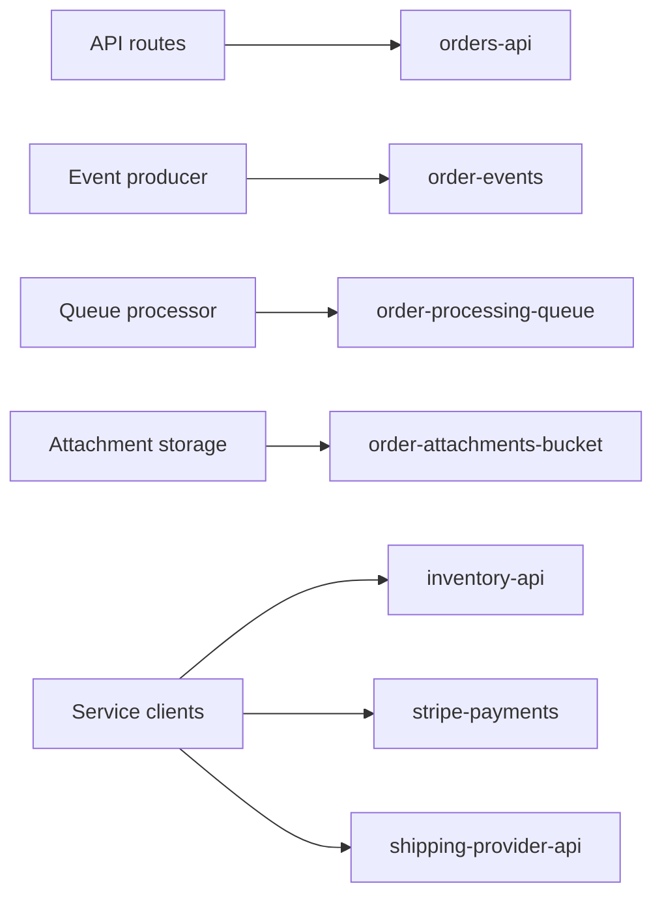

# panopticon-test-child-b — architecture overview

## Purpose

This repository contains TypeScript modules for an Orders REST API, order-event publication, SQS-backed order-job processing, attachment storage, and integrations with inventory, Stripe, and shipping services.

The checked-in code does not include an application bootstrap that mounts the route modules or coordinates these modules into an order-processing workflow. The OpenAPI specification and route handlers define the visible API contract.

## Components

- [api](components/api.md) — defines the Orders REST contract and route handlers.
- [clients](components/clients.md) — calls inventory, Stripe, and shipping providers.
- [events](components/events.md) — declares and publishes order lifecycle events.
- [queue](components/queue.md) — enqueues and long-polls order-processing jobs.
- [storage](components/storage.md) — uploads, retrieves, and deletes order attachments.

## Architecture diagram

```mermaid
flowchart LR
  API[API routes] --> OrdersAPI[orders-api]
  Events[Event producer] --> OrderEvents[order-events]
  Queue[Queue processor] --> OrderQueue[order-processing-queue]
  Storage[Attachment storage] --> Attachments[order-attachments-bucket]
  Clients[Service clients] --> Inventory[inventory-api]
  Clients --> Stripe[stripe-payments]
  Clients --> Shipping[shipping-provider-api]
```

[org diagram](https://github.com/industrial-curiosity/panopticon-test/blob/main/docs/architecture.md#panopticon-test-child-b)

## Data flow

The API component exposes order and webhook route modules and declares `orders-api`. The events component publishes `order-events`. Independently, the queue component sends to and receives from `order-processing-queue`; the storage component manages objects in `order-attachments-bucket`; and client modules call `inventory-api`, `stripe-payments`, and `shipping-provider-api`. The source does not show orchestration between those components.

## Dependencies

This repository consumes the inventory, Stripe, and shipping REST services, SQS queue, and S3 bucket represented in the local index. It also connects to Kafka to publish events. If those systems are unavailable, the corresponding client call, event publication, queue operation, or attachment operation fails; see [interfaces.md](interfaces.md) for the indexed contracts.
