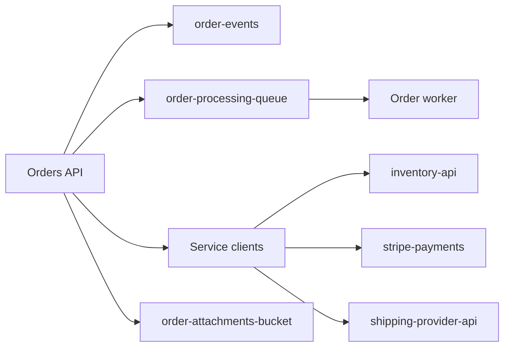

# panopticon-test-child-b — architecture overview

This repository contains the TypeScript artifacts for order lifecycle APIs, event publication, order-job processing, and attachment storage. It defines the public Orders API and the `order-events` Kafka topic while using configured inventory, Stripe, and shipping services.

The repository contains route modules and a worker, but no observable application bootstrap that mounts the routes. The API contract is nevertheless defined by the OpenAPI specification and route handlers.

## Components

- [api](components/api.md) — defines the Orders REST contract and route handlers.
- [clients](components/clients.md) — calls inventory, Stripe, and shipping providers.
- [events](components/events.md) — declares and publishes order lifecycle events.
- [queue](components/queue.md) — enqueues and long-polls order-processing jobs.
- [storage](components/storage.md) — uploads, retrieves, and deletes order attachments.

## Architecture diagram

```mermaid
flowchart LR
  API[Orders API] --> Events[order-events]
  API --> Queue[order-processing-queue]
  API --> Clients[Service clients]
  Clients --> Inventory[inventory-api]
  Clients --> Stripe[stripe-payments]
  Clients --> Shipping[shipping-provider-api]
  Queue --> Worker[Order worker]
  API --> Storage[order-attachments-bucket]
```

[org diagram](https://github.com/industrial-curiosity/panopticon-test/blob/main/docs/architecture.md#panopticon-test-child-b)

## Data flow

The Orders API specifies create, retrieve, update, and cancel operations. Order changes can be published to `order-events`; background jobs are sent to and received from `order-processing-queue`. Client modules call `inventory-api`, `stripe-payments`, and `shipping-provider-api`, while attachment functions store order-scoped objects in `order-attachments-bucket`.

## Dependencies

This service consumes the inventory, Stripe, and shipping REST services. It also requires Kafka, SQS, and S3 through their respective client libraries and configured connection values. If those systems are unavailable, calls, event publication, queue processing, or attachment operations fail in the corresponding module; see [interfaces.md](interfaces.md) for the indexed contracts.
