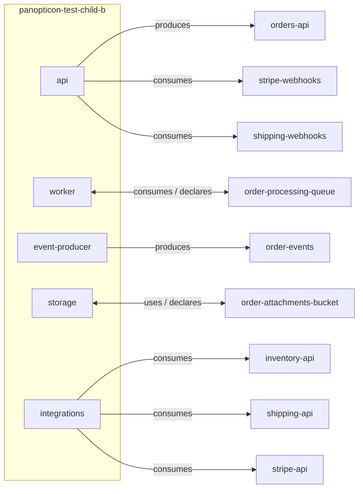

# panopticon-test-child-b — architecture overview

## Purpose

TypeScript order-management service modules: REST order API routes, Kafka order-event
publication, SQS order-job processing, S3 attachment storage, and inventory, payment, and
shipping integrations. The repository does not include an application bootstrap that wires these
modules together — each module is standalone and imports only its own dependencies.

## Components

- [api](components/api.md) — Express REST order API and webhook receivers
- [worker](components/worker.md) — SQS order-processing worker
- [event-producer](components/event-producer.md) — Kafka order-event producer
- [storage](components/storage.md) — S3 attachment storage module
- [integrations](components/integrations.md) — inventory, shipping, and Stripe client modules

## Architecture diagram

```mermaid
flowchart LR
    subgraph repo[panopticon-test-child-b]
        api[api]
        worker[worker]
        event-producer[event-producer]
        storage[storage]
        integrations[integrations]
    end

    api -->|produces| orders-api[orders-api]
    api -->|consumes| stripe-w[stripe-webhooks]
    api -->|consumes| shipping-w[shipping-webhooks]
    event-producer -->|produces| order-events[order-events]
    worker <-->|consumes / declares| order-processing-queue[order-processing-queue]
    storage <-->|uses / declares| order-attachments-bucket[order-attachments-bucket]
    integrations -->|consumes| inventory-api[inventory-api]
    integrations -->|consumes| shipping-api[shipping-api]
    integrations -->|consumes| stripe-api[stripe-api]
```

[Panopticon analysis scope](operations.md#panopticon-analysis-scope)
[org diagram](https://github.com/industrial-curiosity/panopticon-demo/blob/main/docs/architecture.md#panopticon-test-child-b)

## Data flow

Clients call the `orders-api` REST surface (`src/api/routes/orders.ts`) to list, create, update,
and cancel orders; the OpenAPI contract in `src/api/openapi.yaml` describes it. Order lifecycle
events (`order.created`, `order.updated`, `order.cancelled`, `order.shipped`, `order.delivered`)
are published by the event-producer to the `order-events` Kafka topic. Order jobs
(`process` / `fulfill` / `cancel`) are enqueued by the worker's `enqueueOrder` and processed by
its long-polling `runWorker`, which reads from and acknowledges messages on the
`order-processing-queue`. Attachments are uploaded and read from the `order-attachments-bucket`
S3 bucket by the storage module. The integrations module calls `inventory-api`,
`shipping-api`, and `stripe-api` for stock, shipment, and payment operations. Webhook events from
Stripe and the shipping provider arrive at the `api` component's `stripe-webhooks` and
`shipping-webhooks` receivers.

## Dependencies

External systems this repo depends on:

- `inventory-api`, `shipping-api`, `stripe-api` — REST APIs consumed by the integrations module;
  order processing breaks when they are unavailable.
- `stripe-webhooks`, `shipping-webhooks` — webhook events received by the `api` component.
- `order-events` (Kafka), `order-processing-queue` (SQS), `order-attachments-bucket` (S3) —
  shared infrastructure this repo declares and uses; owners are this repo.

Consumed interfaces are listed in [interfaces.md](interfaces.md).
